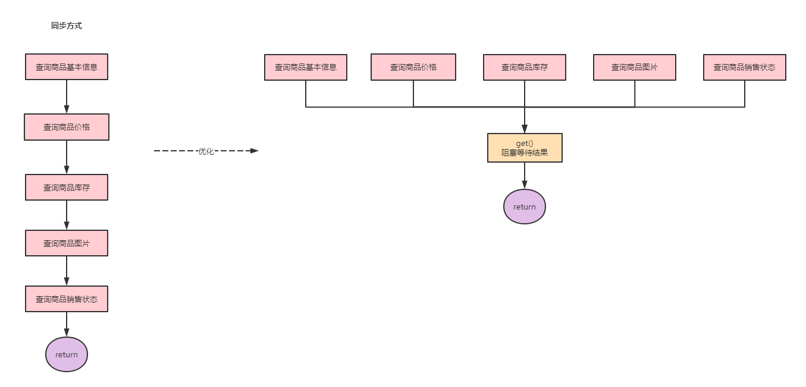

### Future&CompletableFuture 实战

#### 一、Callable& Future&FutureTask

​	直接继承Thread类或者实现Runnable 接口都可以创建线程，但是这两个实现方式都没有返回值， 不能获取任务执行完成后的结果。

​	Callable 接口就解决了这一场景，Future和FutureTask就可以结合 Callable 实现。

##### 1.1、Runnable的缺陷

​	Runnable 不能返回一个返回值

​	不能抛出Checked Exception

​	Callable的call方法可以有返回值，可以声明抛出异常;和Callable配合的Future类，通过Future可以了解任务的执行情况，或者任务的执行，还可以获取执行任务的结果。

```java
package com.zy.thread;

import java.util.concurrent.Callable;
import java.util.concurrent.ExecutionException;
import java.util.concurrent.FutureTask;

/**
 * @author zhouYang
 * @ClassName FutureDemo
 * @Description TODO
 * @create 2024-07-30 11:06
 */
public class FutureDemo {

    public static void main(String[] args) throws ExecutionException, InterruptedException {

        Thread t1 = new Thread(new Runnable() {
            @Override
            public void run() {
                //要执行的任务
                System.out.println("线程t1 通过 Runnable 执行。。。");
            }
        }, "t1");
        t1.start();
        FutureTask<Object> task = new FutureTask<>(new Callable<Object>() {
            @Override
            public Object call() throws Exception {
                System.out.println(" 通过Callable 的方式执行任务");
                return "获取任务的执行结果";
            }
        });
        Thread t2 = new Thread(task, "t2");
        t2.start();
        //获取线程的执行结果
        System.out.println("获取线程的执行结果：" + task.get());}
}
```


##### 1.2	Future API

​	Future 就是对于具体的 Runnable 或者callable 任务的执行结果进行取消 、查询是否完成，并且获取任务的执行结果，必要时可以通过get() 方法返回执行结果，该方法会阻塞知道任务返回结果。

​	1： Boolean cancel(boolean mayInterruptIfRunning) 取消执行的任务，参数指定是否立即中断任务执行，或者等待任务结束。

​	2：Boolean isCancelled() 任务是否已取消，任务正常完成前将其取消，返回true。

​	3：Boolean isDone() <font color='red'>任务是否已经完成</font>;需要注意的是 如果任务正常终止、异常、取消；都将返回true。

​	4：V get() throws InterruptedException, ExecutionException; <font color='red'>等待任务结束，然后获得V类型的结果</font>。InterruptedException 线程被中断异常；ExecutionException 任务执行异常；如果任务被取消，还会抛出 CancellationException。

​	5：V get(long timeout, TimeUnit unit)  throws InterruptedException, ExecutionException, TimeoutException; 等待任务结束，然后获得V类型的结果,多了一个超时时间参数，如果计算超时，则抛出TimeoutException。

##### 1.3	FutureTask 的使用

​	Future stak 既可以被当作 runnable 来执行,也可以被当作Future 来获取Callable的返回结果。

​	  

​	<font color='red'>把 Callable 实例当作FutureTask 构造函数的参数， 生成 FutureTask的对象， 然后把这个对象当作一个Runnable对象，放到线程池中方或者另起一个线程执行，最后还可以通过FutureTask 获取人物的执行结果</font>


```java
public class FutureTaskDemo {

    public static void main(String[] args) {
        Task task = new Task();

        //构建 futureTask实例
        FutureTask<Integer> futureTask = new FutureTask<>(task);
        //启动线程执行任务 传入 Runnable 入参
        new Thread(futureTask).start();
        try {
            //获取线程的执行结果
            System.out.println("获取线程的执行结果：" + futureTask.get());
        } catch (InterruptedException e) {
            e.printStackTrace();
        } catch (Exception e) {
            e.printStackTrace();
        }
    }
    static class Task implements Callable<Integer> {
        @Override
        public Integer call() throws Exception {
            System.out.println(" 子线程开始执行任务。。。。。。。。");
            int sum = 0;
            for (int i = 0; i < 10; i++) {
                sum += i;
                System.out.println("子线程任务执行中。。。。。。。；i= " + i);
            }
            return sum;
        }
    }
}
```


##### 1.4	应用场景案例



​	使用Future  <font color='red'>（异步计算结果）</font>, 并行请求接口，可以提高组合查询的性能。提高接口效率

```java
public class FutureTaskDemo2 {
    public static void main(String[] args) throws ExecutionException, InterruptedException {
        // 获取当前时间 ，计算 接口调用时间
        long start = System.currentTimeMillis();
        System.out.println("接口请求开始时间 start = " + start);
        /**
         * 多线程查询商品信息
         */
        //商品基本信息
        FutureTask<String> task1 = new FutureTask<>(new Task1());
        //商品价格信息
        FutureTask<String> task2 = new FutureTask<>(new Task2());
        //商品库存信息
        FutureTask<String> task3 = new FutureTask<>(new Task3());
        //商品图片信息
        FutureTask<String> task4 = new FutureTask<>(new Task4());
        //构建执行的线程池
        ExecutorService pool = Executors.newFixedThreadPool(4);
        pool.submit(task1);
        pool.submit(task2);
        pool.submit(task3);
        pool.submit(task4);
        //获取执行结果
        String s1 = task1.get();
        String s2 = task2.get();
        String s3 = task3.get();
        String s4 = task4.get();
        System.out.println("s1 = " + s1);
        System.out.println("s2 = " + s2);
        System.out.println("s3 = " + s3);
        System.out.println("s4 = " + s4);
        pool.shutdown();
        long end = System.currentTimeMillis();
        System.out.println("接口请求开始时间 start = " + start);
        System.out.println(end - start);
    }
    static class Task1 implements Callable<String> {
        @Override
        public String call() throws Exception {
            return "查询商品信息成功";
        }
    }
    private static class Task2 implements Callable<String> {
        @Override
        public String call() throws Exception {
            return "查询商品价格信息成功";
        }
    }
    private static class Task3 implements Callable<String> {
        @Override
        public String call() throws Exception {
            return "查询商品库存信息成功";
        }
    }
    private static class Task4 implements Callable<String> {
        @Override
        public String call() throws Exception {
            return "查询商品图片信息成功";
        }
    }
}
```

##### 	

##### 1.5 	Future 的局限性

​	Future 表示一个异步计算的结果。提供了isDone()来检测计算是否已经完成，并且可以通过get()来获取计算结果，但是也有很多的限制：

​		1：并发执行多任务：Future 只提供一个get()方法来获取结果，并且是阻塞的；只能等待。

​		2：无法对多个任务进行链式调用：如果在计算任务完成后执行特定的动作，比如发送邮件，但是Future 没有提供这样的功能。

​		3：无法组合多个人任务：如果运行了10个任务，在所有任务执行结束后在执行特定 的动作。

​		4：没有异常处理：Future 接口没有关于异常的处理方法。

#### 二、CompletableFuture 使用详解

​	Future 处理简单的任务，获取结果还是不错的，但是处理并行提交的多个异步任务，往往并不是独立的，<font color='red'>很多时候的业务逻辑处理存在串行【依赖、并行、聚合关系】</font>，使用Future手动实现就非常麻烦了。

​	CompletableFuture 是Future的增强和扩展接口; CompletableFuture 实现了Future接口，完美的解决了Future的局限性问题， CompletableFuture 实现了对任务的编排能力，可以轻松的组织不同任务的运行顺序、规则 、运行等。

###### 	

##### 2.1 CompletableFuture 的应用场景

###### 	描述依赖关系

​	1：thenApply() 把前面异步任务的结果，交由后面的function。

​	2：thenCompose() 用来连接两个有依赖关系的任务，结果由第二个任务返回。

###### 	描述and 聚合关系

​	1：thenCombine：任务合并，有返回值。

​	2：thenAccepetBoth：两个任务执行完成后，将结果交由thenAccepetBoth消耗，无返回值。

​	3：runAfterBoth：两个任务都执行完成后，执行下一步操作（Runnable）。

###### 	描述or 聚合关系

​	1：applyToEither：两个任务谁执行的快，就使用那一个结果，有返回值。

​	2：acceptEither：两个任务谁执行的快，就消耗那一个结果，无返回值。

​	3：runAfterEither：任意一个任务执行完成，进行下一步操作（Runnable）。

###### 	并行执行

​	CompletableFuture 类自己也提供了anyOf() 和 allOf() 用户支持多个 CompletableFuture 并行执行。


##### 2.2	创建异步操作

​	CompletableFuture 提供了4个静态方法:

```java
		/**
         * 方法接受一个 Runnable 任务，并以异步方式执行该任务
         * 任务完成后返回一个 CompletableFuture<Void> 对象
         * 默认情况下，使用 ForkJoinPool.commonPool() 作为执行任务的线程池
         */
        public static CompletableFuture<Void> runAsync(Runnable runnable)
        /**
         * 方法接受一个 Runnable 任务，并以异步方式执行该任务
         * 任务完成后返回一个 CompletableFuture<Void> 对象
         * 允许传入一个自定义的 Executor 以控制任务的执行方式
         * 自定义的 Executor 可以是 ExecutorService、ScheduledExecutorService、ForkJoinPool 等
         */
        public static CompletableFuture<Void> runAsync(Runnable runnable, Executor executor)
        /**
         * 方法接受一个 Supplier<U> 任务，并以异步方式执行该任务
         * 任务完成后返回一个 CompletableFuture<U> 对象，其中包含任务的结果
         * 默认情况下，使用 ForkJoinPool.commonPool() 作为执行任务的线程池
         */
        public static <U> CompletableFuture<U> supplyAsync(Supplier<U> supplier)
        /**
         * 方法接受一个 Supplier<U> 任务，并以异步方式执行该任务
         * 任务完成后返回一个 CompletableFuture<U> 对象，其中包含任务的结果
         * 允许传入一个自定义的 Executor 以控制任务的执行方式
         */
        public static <U> CompletableFuture<U> supplyAsync(Supplier<U> supplier, Executor executor)		
```


###### 异步四个方法区别：

​	1：runAsync 方法以Runnable 函数式接口类型为参数，没有返回结果，supplyAsync 方法supplier函数式类型为参数，返回结果类型为U；supplier 接口的 get()方法是有返回值的  （<font color='red'>会阻塞</font>）。

​	2：<font color='red'>没有指定Exccutor 的方法会使用 ForkJoinPool() 作为它的线程池执行异步代码。</font> 如果指定线程池，则使用指定的线程池运行。

​	3：默认情况下，CompletableFuture 会使用公共的 FrokJoinPool 线程池，这个线程池默认创建的线程数是核心CPU数；  如果所有CompletableFuture 共享一个线程池，那么一旦有任务执行一些很慢的 I/O 操作，就会导致线程池中所有的线程都阻塞在 I/O 操作上; 从而造成线程饥饿，进而影响整个系统的性能，所以：建议根据不同的业务类型创建不同的线程池，以避免互相干扰。


###### runAsync & supplyAsync 

```java
public class CompletableFutureDemo {

    public static void main(String[] args) throws ExecutionException, InterruptedException {

        //创建一个CompletableFuture 传入 runnable 参数的异步任务
        Runnable runnable = () -> {
            System.out.println(" 创建一个 CompletableFuture 传入 runnable 参数的异步任务");
        };
        CompletableFuture.runAsync(runnable);

        //创建一个CompletableFuture 传入 U 参数的异步任务
        CompletableFuture<String> suppliedAsync = CompletableFuture.supplyAsync(() -> {
            System.out.println(" 创建一个 CompletableFuture 传入 U 参数的异步任务");
            try {
                Thread.sleep(1000);
            } catch (Exception e) {
                e.printStackTrace();
            }
            return "supplyAsync";
        });

        String result = suppliedAsync.get();
        System.out.println("result = " + result);
    }
}
```

###### 获取结果  join & get

​	join() 和 get() 方法都是用来获取COmpletableFuture 异步之后的返回值 ；

​	 join() 方法抛出的是 uncheck 异常 (即未经过检查的异常)，不会强制开发者抛出。

​	 get()  方法抛出的是经过检查的异常，ExecutionException、InterruptedException 需要用户手动处理 （抛出或者 try-catch）。

##### 2.3 结果处理

​	当CompletableFuture 的计算结果完成，或者抛出异常的时候，我们就可以 执行特殊的Action。 下面是主要的方法：

​	作用：这个方法用于在 CompletableFuture 完成后执行给定的 BiConsumer 操作。无论异步任务成功或失败，都会调用 action 处理结果和异常。
​	参数：BiConsumer<? super T, ? super Throwable> action: 一个接收两个参数的操作，第一个参数是异步计算成功后的结果 T，第二个参数是可能出现的异常 Throwable。
​	返回值：返回一个新的 `CompletableFuture`，其结果与原来的 `CompletableFuture` 相同。
​	场景：当你希望在异步任务完成后执行某些额外操作，无论该操作是否成功或失败时使用。例如，日志记录或资源清理。

```java
public CompletableFuture<T> whenComplete(BiConsumer<? super T,? super Throwable> action)
```

​	

​	作用：与 `whenComplete` 类似，但 `action` 在异步线程中执行，而不是当前线程中。

​	参数：`BiConsumer<? super T, ? super Throwable> action`: 与 `whenComplete` 中的参数相同。

​	返回值：返回一个新的 `CompletableFuture`，其结果与原来的 `CompletableFuture` 相同。

​	场景：当你希望在任务完成后，异步地执行一些操作，而不阻塞当前线程时使用。

```java
public CompletableFuture<T> whenCompleteAsync(BiConsumer<? super T,? super Throwable> action)
```

​	

​	作用：与 `whenCompleteAsync(action)` 类似，但可以通过传递一个 `Executor` 来控制执行 `action` 的线程池。

​	参数：`BiConsumer<? super T, ? super Throwable> action`: 与前面的方法相同。

​		   Executor executor`: 用于执行 `action` 的线程池。

​	返回值：返回一个新的 `CompletableFuture`，其结果与原来的 `CompletableFuture` 相同。

​	场景：当你希望在任务完成后，使用特定的线程池异步执行一些操作时使用。可以更好地控制线程的使用，避免阻塞重要的线程。

```java
public CompletableFuture<T> whenCompleteAsync(BiConsumer<? super T,? super Throwable> action, Executor executor)
```


​	作用： 这个方法用于处理 `CompletableFuture` 中的异常情况。它允许你在发生异常时提供一个替代结果。

​	参数：`Function<Throwable, ? extends T> fn`: 一个函数，用于处理 `CompletableFuture` 的异常。它接受一个 `Throwable` 参数，并返回一个替代结果 `T`。

​	返回值：返回一个新的 `CompletableFuture`，如果原来的 `CompletableFuture` 抛出异常，它将使用 `fn` 处理并返回一个替代结果。

​	场景： 当你希望在异步操作失败时提供一个默认值或处理异常时使用。

```java
public CompletableFuture<T> exceptionally(Function<Throwable,? extends T> fn)
```


总结：

- `whenComplete` 系列方法允许你在任务完成后，无论成功还是失败，都执行一个额外的操作。

- `exceptionally` 方法允许你在任务失败时提供一个替代结果。

- <font color='red'>方法不以Async结尾，意味着Action使用相同的线程执行，而Async可能会使用其它的线程去执行(如果使用相同的线程池，也可能会被同一个线程选中执行)。</font>

  

###### whenComplete&exceptionally 使用

​	`join()` 会阻塞线程，直到 `CompletableFuture` 完成。

```java
public class CompletableFutureWhenCompleteDemo {
    public static void main(String[] args) throws ExecutionException, InterruptedException {
        CompletableFuture<String> future = CompletableFuture.supplyAsync(() -> {
            try {
                TimeUnit.SECONDS.sleep(1);
            } catch (InterruptedException e) {
            }
            if (new Random().nextInt(10) % 2 == 0) {
                int i = 12 / 0;
            }
            System.out.println("执行结束！");
            return "test";
        });

        //无论上面的逻辑是否成功还是失败，都会执行 whenComplete
        future.whenComplete(new BiConsumer<String, Throwable>() {
            @Override
            public void accept(String t, Throwable action) {
                System.out.println(t+" 执行完成！");
            }
        });
        //异常捕捉处理
        future.exceptionally(new Function<Throwable, String>() {
            @Override
            public String apply(Throwable t) {
                System.out.println("执行失败：" + t.getMessage());
                return "异常xxxx";
            }
        }).join();
        //确保main线程 等待异步任务的完成，使得异常处理或者处理结果都可以正确的执行。
        //future.join();
    }
}
```


##### 2.4 结果转换

​	就是将上一段任务的执行结果作为下一个阶段任务的入参参与重新计算，产生新的结果。

###### thenApply

​	thenApply 接收一个函数作为参数，使用该函数处理上一个CompletableFuture 调用的结果，并返回一个具有处理结果的Future对象。

```java
public <U> CompletableFuture<U> thenApply(Function<? super T,? extends U> fn)
public <U> CompletableFuture<U> thenApplyAsync(Function<? super T,? extends U> fn)
public <U> CompletableFuture<U> thenApplyAsync(Function<? super T,? extends U> fn, Executor executor) 
```

​	代码示例：

```java
public class CompletaleFutureThenApplyDemo {
    public static void main(String[] args) throws ExecutionException, InterruptedException {

        CompletableFuture<Integer> future = CompletableFuture.supplyAsync(() -> {
            int result = 10;
            System.out.println("异步任务执行第一阶段，result = " + result);
            return result;
        }).thenApplyAsync(num -> {
            System.out.println("num 结果：" + num);
            int result = num * 3;
            System.out.println("异步任务执行第二阶段，result = " + result);
            return result;
        });
        Integer res = future.get();
        System.out.println("res = " + res);
    }
}
```

###### thenCompose 

​	thenCompose 主要还是在于释放主线的阻塞，让系统更高效的处理其他并发任务。同时，允许任务之间进行灵活的线程调度。 

​	thenCompose 的参数作为一个返回 CompltableFuture 实例的函数，该函数的参数是先前计算步骤的结果。

```java
public <U> CompletableFuture<U> thenCompose(Function<? super T, ? extends CompletionStage<U>> fn);
public <U> CompletableFuture<U> thenComposeAsync(Function<? super T, ? extends CompletionStage<U>> fn) ;
public <U> CompletableFuture<U> thenComposeAsync(Function<? super T, ? extends CompletionStage<U>> fn, Executor executor) ;
```

​	代码示例：

```java
public class CompletableThenComposeDemo {
    public static void main(String[] args) throws ExecutionException, InterruptedException {

        CompletableFuture<Integer> future = CompletableFuture.supplyAsync(new Supplier<Integer>() {
            @Override
            public Integer get() {
                int number = new Random().nextInt(30);
                System.out.println("第一阶段：" + number);
                return number;
            }
        }).thenCompose(new Function<Integer, CompletionStage<Integer>>() {
            @Override
            public CompletionStage<Integer> apply(Integer param) {
                return CompletableFuture.supplyAsync(new Supplier<Integer>() {
                    @Override
                    public Integer get() {
                        System.out.println(" 第二阶段执行中，param = " + param);
                        int number = param * 2;
                        System.out.println("第二阶段：" + number);
                        return number;
                    }
                });
            }
        });
        System.out.println("返回结果 result ： "+ future.get());
    }
}
```

###### thenApply 和 thenCompose的区别

​	thenApply 转换的类型是泛型中的类型，返回的是同一个CompletableFuture。	

​	thenCompose 将内部的CompletableFuture 调用展开来并使用上一个CompletableFuture 调用的结果在下一步的CompletableFuture 调用中进行运算，是生成一个新的CompletableFuture。

```java
代码示例：
public class CompletableFutureThenApplyOrThenComposeDemo {

    public static void main(String[] args) throws ExecutionException, InterruptedException {
        CompletableFuture<String> future = CompletableFuture.supplyAsync(() -> "hello ");
        CompletableFuture<String> thenApply = future.thenApply(parm -> parm + "world");
        CompletableFuture<String> thenCompose = future.thenCompose(parm -> CompletableFuture.supplyAsync(() -> parm + "world"));
        System.out.println(thenApply.get());
        System.out.println(thenCompose.get());

    }
}
```

​	

##### 2.5 结果消费

​	与结果处理和结果转换系列函数返回一个新的CompletableFuture 不同，结果消费系列函数只对结果执行Action，而不返回新的计算值。

​	消费函数：

- thenAccept系列：对单个结果进行消费

- thenAcceptBoth系列：对两个结果进行消费

- thenRun系列：不关心结果，只对结果执行Action

  

###### thenAccept

​	通过观察该系列函数的参数类型，它们是函数式接口Consumer；这个接口只有输入，没有返回值。

```java
public CompletionStage<Void> thenAccept(Consumer<? super T> action);
public CompletionStage<Void> thenAcceptAsync(Consumer<? super T> action);
public CompletionStage<Void> thenAcceptAsync(Consumer<? super T> action,Executor executor);
```

​	代码示例

```java
public class CompletableFutureThenAcceptDemo {
    public static void main(String[] args) throws ExecutionException, InterruptedException {
        CompletableFuture<Void> future = CompletableFuture.supplyAsync(() -> {
            int num = 10;
            System.out.println("异步任务执行第一阶段，num = " + num);
            return num;
        }).thenAccept(num -> System.out.println("异步任务执行第二阶段，num = " + num * 2));
        System.out.println(future.get());
    }
}
```

###### 	thenAcceptBoth

​		thenAcceptBoth 函数的作用是，当两个 CompletionStage 都正常完成计算的时候，就会执行提供的action消费两个异步的结果。

```java
public <U> CompletionStage<Void> thenAcceptBoth(CompletionStage<? extends U> other,BiConsumer<? super T, ? super U> action);
public <U> CompletionStage<Void> thenAcceptBothAsync(CompletionStage<? extends U> other,BiConsumer<? super T, ? super U> action);
public <U> CompletionStage<Void> thenAcceptBothAsync(CompletionStage<? extends U> other,BiConsumer<? super T, ? super U> action,     Executor executor);
```

​	代码示例：

```java
public class CompletableFutureThenAcceptBothDemo {
    public static void main(String[] args) {
        CompletableFuture<Integer> future1 = CompletableFuture.supplyAsync(() -> {
            int num = 10;
            System.out.println("异步任务 future1，num = " + num);
            return num;
        });
        CompletableFuture<Integer> future2 = CompletableFuture.supplyAsync(() -> {
            int num = 20;
            System.out.println("异步任务 future2，num = " + num);
            return num;
        });
        future1.thenAcceptBoth(future2, new BiConsumer<Integer, Integer>() {
            @Override
            public void accept(Integer integer, Integer integer2) {
                System.out.println("异步任务执行最终结果 BiConsumer t1 + t2 = " + (integer + integer2));
            }
        }).join();
        System.out.println("main 线程结束");
    }
}
```

###### thenRun

​	 thenRun 也是对线程任务结果的一种消费线程，与Accept 的不同是，thenRun会在上一阶段 CompletableFuture计算完成的时候执行一个Runnable；Runnable 并不使用该CompletableFuture计算的结果。

```java
public CompletionStage<Void> thenRun(Runnable action);
public CompletionStage<Void> thenRunAsync(Runnable action);
public CompletionStage<Void> thenRunAsync(Runnable action,Executor executor);
```

​	示例：

```java
public class CompletableFutureTaskDemo {

    public static void main(String[] args) throws ExecutionException, InterruptedException {
        thenRunTask();
    }
    //消费函数 thenRun
    public static void thenRunTask() throws ExecutionException, InterruptedException {
        CompletableFuture<Void> future = CompletableFuture.supplyAsync(() -> {
            System.out.println("hello world");
            return "hello world";
        }).thenRun(new Runnable() {
            @Override
            public void run() {
                System.out.println("thenRun ");
            }
        });
        System.out.println("最终结果：" + future.get());
    }
}
```


##### 2.6 结果组合 

###### 	-thenCombine

​	thenCombine方法，合并两个线程任务的结果，进一步处理

```java
public <U,V> CompletionStage<V> thenCombine(CompletionStage<? extends U> other,BiFunction<? super T,? super U,? extends V> fn);
public <U,V> CompletionStage<V> thenCombineAsync(CompletionStage<? extends U> other,BiFunction<? super T,? super U,? extends V> fn);
public <U,V> CompletionStage<V> thenCombineAsync(CompletionStage<? extends U> other,BiFunction<? super T,? super U,? extends V> fn,Executor executor);
```

示例代码：

```java
public class CompletableFutureTaskDemo {
    public static void main(String[] args) throws ExecutionException, InterruptedException {
        thenCombineTask();
    }
    //thenCombine
    public static void thenCombineTask() throws ExecutionException, InterruptedException {
        CompletableFuture<Integer> future1 = CompletableFuture.supplyAsync(() -> {
            System.out.println("future1");
            return 1;
        });
        CompletableFuture<Integer> future2 = CompletableFuture.supplyAsync(() -> {
            System.out.println("future2");
            return 2;
        });
        future1.thenCombine(future2, (t1, t2) -> {
            System.out.println(t1 + t2);
            return t1 + t2;
        });
        System.out.println("最终结果：" + future1.get());
    }
}
```

​	

##### 2.7 任务交互 

​	所谓的任务交互，是指将两个线程任务获取结果的速度相比较，按一定的顺序规则进行下一步处理。

​	applyToEither ：两个线程任务相比较，先获得执行结果的，就对该结果进行下一步的转化操作。

```java
public <U> CompletionStage<U> applyToEither(CompletionStage<? extends T> other,Function<? super T, U> fn);
public <U> CompletionStage<U> applyToEitherAsync(CompletionStage<? extends T> other,Function<? super T, U> fn);
public <U> CompletionStage<U> applyToEitherAsync(CompletionStage<? extends T> other,Function<? super T, U> fn,Executor executor);
```

​	示例：

```java
//任务交互 所谓线程交互，是指 将两个线程任务获取结果的速度相比较，按一定的顺序进行下一步处理。
//如果是使用异步去处理的话，就不需要join().同步方法处理的时候就需要Join().join 方法等待异步计算完成，并返回其结果
public static void applyToEitherTask() throws ExecutionException, InterruptedException {

    CompletableFuture<Integer> future1 = CompletableFuture.supplyAsync(new Supplier<Integer>() {
        @Override
        public Integer get() {
            int i = 5;
            try {
                TimeUnit.SECONDS.sleep(i);
            } catch (InterruptedException e) {
                throw new RuntimeException(e);
            }
            return i;
        }
    });

    CompletableFuture<Integer> future2 = CompletableFuture.supplyAsync(new Supplier<Integer>() {
        @Override
        public Integer get() {
            int i = 10;
            return i;
        }
    });

    future1.applyToEitherAsync(future2, new Function<Integer, Integer>() {
        @Override
        public Integer apply(Integer i) {
            System.out.println(i);
            return i;
        }
    });
}
```


###### acceptEither

​	两个线程任务相比较，先获得执行结果的，就对该结果进行下一步的消费操作.

```java
public CompletionStage<Void> acceptEither(CompletionStage<? extends T> other,Consumer<? super T> action);
public CompletionStage<Void> acceptEitherAsync(CompletionStage<? extends T> other,Consumer<? super T> action);
public CompletionStage<Void> acceptEitherAsync(CompletionStage<? extends T> other,Consumer<? super T> action,Executor executor);
```

示例：

```java
// acceptEither 两个线程执行任务，先获得执行结果的，就对该结果进行下一步的消费操作。
    private static void acceptEitherTask() {
        CompletableFuture<Integer> f1 = CompletableFuture.supplyAsync(new Supplier<Integer>() {
            @Override
            public Integer get() {
                int rest = 5;
                try {
                    TimeUnit.SECONDS.sleep(rest);
                } catch (InterruptedException e) {
                    throw new RuntimeException(e);
                }
                return rest;
            }
        });
        CompletableFuture<Integer> f2 = CompletableFuture.supplyAsync(new Supplier<Integer>() {
            @Override
            public Integer get() {
                int rest = 2;
                try {
                    TimeUnit.SECONDS.sleep(rest);
                } catch (InterruptedException e) {
                    throw new RuntimeException(e);
                }
                return rest;
            }
        });
        f1.acceptEither(f2, new Consumer<Integer>() {
            @Override
            public void accept(Integer rest) {
                System.out.println("最快结果：" + rest);
            }
        }).join();
    }
```


###### runAfterEither

两个线程任务相比较，有任何一个执行完，就进行下一步操作，不关心线程运行的结果。

```java
public CompletionStage<Void> runAfterEither(CompletionStage<?> other,Runnable action);
public CompletionStage<Void> runAfterEitherAsync(CompletionStage<?> other,Runnable action);
public CompletionStage<Void> runAfterEitherAsync(CompletionStage<?> other,Runnable action,Executor executor);
```

示例：

```java
//runAfterEither 两个线程任务相比较， 有任何一个执行完成，就进行下一步操作，不关心运行的结果,
    private static void runAfterEither() {
        CompletableFuture<Integer> r1 = CompletableFuture.supplyAsync(new Supplier<Integer>() {
            @Override
            public Integer get() {
                int rest = 5;
                try {
                    TimeUnit.SECONDS.sleep(rest);
                } catch (InterruptedException e) {
                    throw new RuntimeException(e);
                }
                return rest;
            }
        });

        CompletableFuture<Integer> r2 = CompletableFuture.supplyAsync(new Supplier<Integer>() {
            @Override
            public Integer get() {
                System.out.println("我这个线程先执行完 。。 ");
                return 1;
            }
        });
        r1.runAfterEither(r2, new Runnable() {
            @Override
            public void run() {
                System.out.println("有一个线程执行结束 。。 ");
            }
        });
    }
```

###### runAfterBoth

​	两个线程任务相比较，两个全部执行完成，才进行下一步操作，不关心线程的运行结果。

```java
public CompletionStage<Void> runAfterBoth(CompletionStage<?> other,Runnable action);
public CompletionStage<Void> runAfterBothAsync(CompletionStage<?> other,Runnable action);
public CompletionStage<Void> runAfterBothAsync(CompletionStage<?> other,Runnable action,Executor executor);
```

​	示例：

```java
//runAfterBoth 两个线程执行任务， 两个线程执行完成，就进行下一步操作，不关心运行的结果
    private static void runAfterBothTask() throws ExecutionException, InterruptedException {
        CompletableFuture<Integer> r1 = CompletableFuture.supplyAsync(new Supplier<Integer>() {
            @Override
            public Integer get() {
                return 1;
            }
        });
        CompletableFuture<Integer> r2 = CompletableFuture.supplyAsync(new Supplier<Integer>() {
            @Override
            public Integer get() {
                return 2;
            }
        });
        r1.runAfterBoth(r2, new Runnable() {
            @Override
            public void run() {
                System.out.println("上面两个任务都执行完成了。");
            }
        }).get();
    }
```

###### anyOf

方法

```java
public static CompletableFuture<Object> anyOf(CompletableFuture<?>... cfs)
```

代码示例：

```java
//anyOf方法的参数是给定多个 CompletableFuture ，当其中的任何一个完成时，方法返回这个 CompletableFuture。
    private static void anyOfTask() throws ExecutionException, InterruptedException {
        Random random = new Random();
        CompletableFuture<String> future1 = CompletableFuture.supplyAsync(() -> {
            try {
                int num = random.nextInt(5);
                System.out.println(" future1 = " + num);
                TimeUnit.SECONDS.sleep(num);
            } catch (InterruptedException e) {
                throw new RuntimeException(e);
            }
            return "hello ";
        });
        CompletableFuture<String> future2 = CompletableFuture.supplyAsync(() -> {
            try {
                int num = random.nextInt(5);
                System.out.println(" future2 = " + num);
                TimeUnit.SECONDS.sleep(num);
            } catch (InterruptedException e) {
                throw new RuntimeException(e);
            }
            return "world";
        });

        CompletableFuture<Object> anyOf = CompletableFuture.anyOf(future1, future2);
        System.out.println(" anyOf = " + anyOf.get());
    }
```

###### allOf

​	allOf方法用来实现多CompletableFuture 的同时返回

```java
public static CompletableFuture<Void> allOf(CompletableFuture<?>... cfs)
```

​	示例：

```java
//allOf  allOf方法用来实现多 CompletableFuture 的同时返回。
    private static void allOfTask() {

        Random random = new Random();

        CompletableFuture<String> future1 = CompletableFuture.supplyAsync(() -> {
            try {
                int num = random.nextInt(5);
                System.out.println(" future1 = " + num);
                TimeUnit.SECONDS.sleep(num);
            } catch (InterruptedException e) {
                throw new RuntimeException(e);
            }
            return "hello ";
        });

        CompletableFuture<String> future2 = CompletableFuture.supplyAsync(() -> {
            try {
                int num = random.nextInt(5);
                System.out.println(" future2 = " + num);
                TimeUnit.SECONDS.sleep(num);
            } catch (InterruptedException e) {
                throw new RuntimeException(e);
            }
            return "world";
        });

        CompletableFuture<Void> allOf = CompletableFuture.allOf(future1, future2);
        try {
            allOf.get();
        } catch (InterruptedException e) {
            throw new RuntimeException(e);
        } catch (ExecutionException e) {
            throw new RuntimeException(e);
        }
        System.out.println("future1: " + future1.isDone() + "，future2: " + future2.isDone());
    }
```

##### 2.8 场景案例

​	

###### 基于FutureTask实现

```java
public class FutureTaskDemo01 {

    public static void main(String[] args) throws ExecutionException, InterruptedException {
        //基于 Future 实现
        FutureTask<String> task2 = new FutureTask<>(new T2Task());
        FutureTask<String> task1 = new FutureTask<>(new T1Task(task2));

        Thread t1 = new Thread(task1);
        Thread t2 = new Thread(task2);
        t1.start();
        t2.start();
        // 等待线程T1执行结果
        System.out.println(task1.get());
    }

}

class T1Task implements Callable<String> {
    FutureTask<String> task2;

    //t1 的任务需要t2 任务的执行结果
    T1Task(FutureTask<String> task2) {
        this.task2 = task2;
    }

    @Override
    public String call() throws Exception {
        System.out.println(" T1 ： 洗水壶 。。。");
        TimeUnit.SECONDS.sleep(1);

        System.out.println(" T1 ： 洗茶壶 。。。");
        TimeUnit.SECONDS.sleep(2);

        //通过线程2 拿取茶叶
        String tf = task2.get();
        System.out.println("T1:拿到茶叶:" + tf);

        System.out.println("T1:泡茶...");
        return "上茶:" + tf;
    }
}

class T2Task implements Callable<String> {
    @Override
    public String call() throws Exception {
        System.out.println(" T2 ： 洗茶壶 。。。");
        TimeUnit.SECONDS.sleep(1);

        System.out.println(" T2 ： 洗茶叶");
        TimeUnit.SECONDS.sleep(2);

        System.out.println(" T2 ： 那茶叶 。。。");
        TimeUnit.SECONDS.sleep(3);
        return " 龙井";
    }
}
```


###### 基于CompletableFuture实现

```java
public class CompletableFutureTaskDemo01 {

    public static void main(String[] args) {
        //基于CompletableFuture 实现
        //任务1：洗水壶->烧开水
        CompletableFuture<Void> future1 = CompletableFuture.runAsync(new Runnable() {
            @Override
            public void run() {
                sleep(1, TimeUnit.SECONDS);
                System.out.println("T1:洗水壶...");

                System.out.println("T1:烧开水...");
                sleep(15, TimeUnit.SECONDS);
            }
        });

        //任务2：洗茶壶->洗茶杯->拿茶叶
        CompletableFuture<String> future2 = CompletableFuture.supplyAsync(new Supplier<String>() {
            @Override
            public String get() {
                System.out.println("T2:洗茶壶...");
                sleep(1, TimeUnit.SECONDS);

                System.out.println("T2:洗茶杯...");
                sleep(2, TimeUnit.SECONDS);

                System.out.println("T2:拿茶叶...");
                sleep(1, TimeUnit.SECONDS);
                return "龙井";
            }
        });

        CompletableFuture<String> future3 = future1.thenCombine(future2, (__, tf) -> {
            System.out.println("T1:拿到茶叶:" + tf);
            System.out.println("T1:泡茶...");
            return "上茶:" + tf;
        });
        try {
            System.out.println("最终执行结果:" + future3.get());
        } catch (InterruptedException e) {
            throw new RuntimeException(e);
        } catch (ExecutionException e) {
            throw new RuntimeException(e);
        }
    }

    static void sleep(int t, TimeUnit u) {
        try {
            u.sleep(t);
        } catch (InterruptedException e) {
        }
    }
}
```


​	


​	

​	

