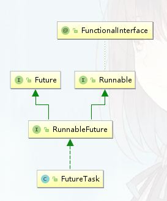

### Future&CompletableFuture 实战

#### 一、Callable& Future&FutureTask

​	直接继承Thread类或者实现Runnable 接口都可以创建线程，但是这两个实现方式都没有返回值， 不能获取任务执行完成后的结果。

​	Callable 接口就解决了这一场景，Future和FutureTask就可以结合 Callable 实现。

##### 1.1、Runnable的缺陷

​	Runnable 不能返回一个返回值

​	不能抛出Checked Exception

​	Callable的call方法可以有返回值，可以声明抛出异常;和Callable配合的Future类，通过Future可以了解任务的执行情况，或者任务的执行，还可以获取执行任务的结果。

```java
package com.zy.thread;

import java.util.concurrent.Callable;
import java.util.concurrent.ExecutionException;
import java.util.concurrent.FutureTask;

/**
 * @author zhouYang
 * @ClassName FutureDemo
 * @Description TODO
 * @create 2024-07-30 11:06
 */
public class FutureDemo {

    public static void main(String[] args) throws ExecutionException, InterruptedException {

        Thread t1 = new Thread(new Runnable() {
            @Override
            public void run() {
                //要执行的任务
                System.out.println("线程t1 通过 Runnable 执行。。。");
            }
        }, "t1");
        t1.start();
        FutureTask<Object> task = new FutureTask<>(new Callable<Object>() {
            @Override
            public Object call() throws Exception {
                System.out.println(" 通过Callable 的方式执行任务");
                return "获取任务的执行结果";
            }
        });
        Thread t2 = new Thread(task, "t2");
        t2.start();
        //获取线程的执行结果
        System.out.println("获取线程的执行结果：" + task.get());}
}
```


##### 1.2	Future API

​	Future 就是对于具体的 Runnable 或者callable 任务的执行结果进行取消 、查询是否完成，并且获取任务的执行结果，必要时可以通过get() 方法返回执行结果，该方法会阻塞知道任务返回结果。

​	1： Boolean cancel(boolean mayInterruptIfRunning) 取消执行的任务，参数指定是否立即中断任务执行，或者等待任务结束。

​	2：Boolean isCancelled() 任务是否已取消，任务正常完成前将其取消，返回true。

​	3：Boolean isDone() <font color='red'>任务是否已经完成</font>;需要注意的是 如果任务正常终止、异常、取消；都将返回true。

​	4：V get() throws InterruptedException, ExecutionException; <font color='red'>等待任务结束，然后获得V类型的结果</font>。InterruptedException 线程被中断异常；ExecutionException 任务执行异常；如果任务被取消，还会抛出 CancellationException。

​	5：V get(long timeout, TimeUnit unit)  throws InterruptedException, ExecutionException, TimeoutException; 等待任务结束，然后获得V类型的结果,多了一个超时时间参数，如果计算超时，则抛出TimeoutException。

##### 1.3	FutureTask 的使用

​	Future stak 既可以被当作 runnable 来执行,也可以被当作Future 来获取Callable的返回结果。

​	  

​	<font color='red'>把 Callable 实例当作FutureTask 构造函数的参数， 生成 FutureTask的对象， 然后把这个对象当作一个Runnable对象，放到线程池中方或者另起一个线程执行，最后还可以通过FutureTask 获取人物的执行结果</font>


```java
public class FutureTaskDemo {

    public static void main(String[] args) {
        Task task = new Task();

        //构建 futureTask实例
        FutureTask<Integer> futureTask = new FutureTask<>(task);
        //启动线程执行任务 传入 Runnable 入参
        new Thread(futureTask).start();
        try {
            //获取线程的执行结果
            System.out.println("获取线程的执行结果：" + futureTask.get());
        } catch (InterruptedException e) {
            e.printStackTrace();
        } catch (Exception e) {
            e.printStackTrace();
        }
    }
    static class Task implements Callable<Integer> {
        @Override
        public Integer call() throws Exception {
            System.out.println(" 子线程开始执行任务。。。。。。。。");
            int sum = 0;
            for (int i = 0; i < 10; i++) {
                sum += i;
                System.out.println("子线程任务执行中。。。。。。。；i= " + i);
            }
            return sum;
        }
    }
}
```


##### 1.4	应用场景案例

​	使用Future  <font color='red'>（异步计算结果）</font>, 并行请求接口，可以提高组合查询的性能。提高接口效率

```java
public class FutureTaskDemo2 {
    public static void main(String[] args) throws ExecutionException, InterruptedException {
        // 获取当前时间 ，计算 接口调用时间
        long start = System.currentTimeMillis();
        System.out.println("接口请求开始时间 start = " + start);
        /**
         * 多线程查询商品信息
         */
        //商品基本信息
        FutureTask<String> task1 = new FutureTask<>(new Task1());
        //商品价格信息
        FutureTask<String> task2 = new FutureTask<>(new Task2());
        //商品库存信息
        FutureTask<String> task3 = new FutureTask<>(new Task3());
        //商品图片信息
        FutureTask<String> task4 = new FutureTask<>(new Task4());
        //构建执行的线程池
        ExecutorService pool = Executors.newFixedThreadPool(4);
        pool.submit(task1);
        pool.submit(task2);
        pool.submit(task3);
        pool.submit(task4);
        //获取执行结果
        String s1 = task1.get();
        String s2 = task2.get();
        String s3 = task3.get();
        String s4 = task4.get();
        System.out.println("s1 = " + s1);
        System.out.println("s2 = " + s2);
        System.out.println("s3 = " + s3);
        System.out.println("s4 = " + s4);
        pool.shutdown();
        long end = System.currentTimeMillis();
        System.out.println("接口请求开始时间 start = " + start);
        System.out.println(end - start);
    }
    static class Task1 implements Callable<String> {
        @Override
        public String call() throws Exception {
            return "查询商品信息成功";
        }
    }
    private static class Task2 implements Callable<String> {
        @Override
        public String call() throws Exception {
            return "查询商品价格信息成功";
        }
    }
    private static class Task3 implements Callable<String> {
        @Override
        public String call() throws Exception {
            return "查询商品库存信息成功";
        }
    }
    private static class Task4 implements Callable<String> {
        @Override
        public String call() throws Exception {
            return "查询商品图片信息成功";
        }
    }
}
```

##### 	

##### 1.5 	Future 的局限性

​	Future 表示一个异步计算的结果。提供了isDone()来检测计算是否已经完成，并且可以通过get()来获取计算结果，但是也有很多的限制：

​		1：并发执行多任务：Future 只提供一个get()方法来获取结果，并且是阻塞的；只能等待。

​		2：无法对多个任务进行链式调用：如果在计算任务完成后执行特定的动作，比如发送邮件，但是Future 没有提供这样的功能。

​		3：无法组合多个人任务：如果运行了10个任务，在所有任务执行结束后在执行特定 的动作。

​		4：没有异常处理：Future 接口没有关于异常的处理方法。

#### 二、CompletableFuture 使用详解

​	Future 处理简单的任务，获取结果还是不错的，但是处理并行提交的多个异步任务，往往并不是独立的，<font color='red'>很多时候的业务逻辑处理存在串行【依赖、并行、聚合关系】</font>，使用Future手动实现就非常麻烦了。

​	CompletableFuture 是Future的增强和扩展接口; CompletableFuture 实现了Future接口，完美的解决了Future的局限性问题， CompletableFuture 实现了对任务的编排能力，可以轻松的组织不同任务的运行顺序、规则 、运行等。

###### 	

##### 2.1 completableFuture 的应用场景

###### 	描述依赖关系

​	1：thenApply() 把前面异步任务的结果，交由后面的function。

​	2：thenCompose() 用来连接两个有依赖关系的任务，结果由第二个任务返回。

###### 	描述and 聚合关系

​	1：thenCombine：任务合并，有返回值。

​	2：thenAccepetBoth：两个任务执行完成后，将结果交由thenAccepetBoth消耗，无返回值。

​	3：runAfterBoth：两个任务都执行完成后，执行下一步操作（Runnable）。

###### 	描述or 聚合关系

​	1：applyToEither：两个任务谁执行的快，就使用那一个结果，有返回值。

​	2：acceptEither：两个任务谁执行的快，就消耗那一个结果，无返回值。

​	3：runAfterEither：任意一个任务执行完成，进行下一步操作（Runnable）。

###### 	并行执行

​	CompletableFuture 类自己也提供了anyOf() 和 allOf() 用户支持多个 CompletableFuture 并行执行。


##### 2.2	创建异步操作

​	CompletableFuture 提供了4个静态方法:

```java
		/**
         * 方法接受一个 Runnable 任务，并以异步方式执行该任务
         * 任务完成后返回一个 CompletableFuture<Void> 对象
         * 默认情况下，使用 ForkJoinPool.commonPool() 作为执行任务的线程池
         */
        public static CompletableFuture<Void> runAsync(Runnable runnable)
        /**
         * 方法接受一个 Runnable 任务，并以异步方式执行该任务
         * 任务完成后返回一个 CompletableFuture<Void> 对象
         * 允许传入一个自定义的 Executor 以控制任务的执行方式
         * 自定义的 Executor 可以是 ExecutorService、ScheduledExecutorService、ForkJoinPool 等
         */
        public static CompletableFuture<Void> runAsync(Runnable runnable, Executor executor)
        /**
         * 方法接受一个 Supplier<U> 任务，并以异步方式执行该任务
         * 任务完成后返回一个 CompletableFuture<U> 对象，其中包含任务的结果
         * 默认情况下，使用 ForkJoinPool.commonPool() 作为执行任务的线程池
         */
        public static <U> CompletableFuture<U> supplyAsync(Supplier<U> supplier)
        /**
         * 方法接受一个 Supplier<U> 任务，并以异步方式执行该任务
         * 任务完成后返回一个 CompletableFuture<U> 对象，其中包含任务的结果
         * 允许传入一个自定义的 Executor 以控制任务的执行方式
         */
        public static <U> CompletableFuture<U> supplyAsync(Supplier<U> supplier, Executor executor)		
```


​	


​	

​	

